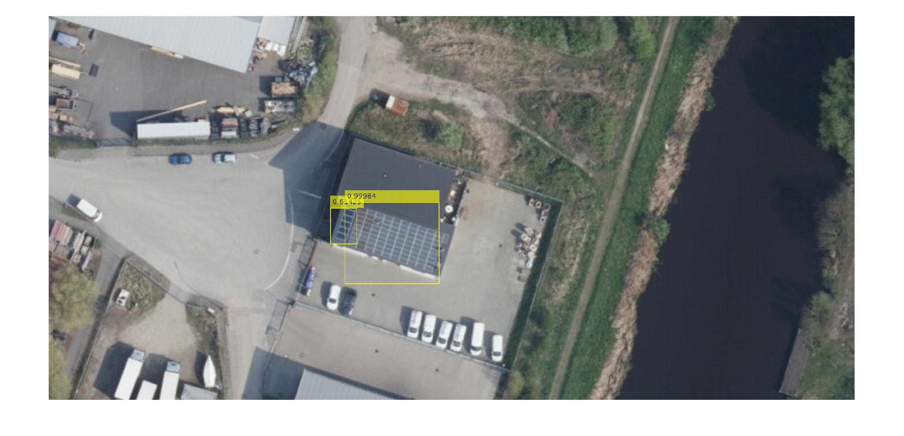
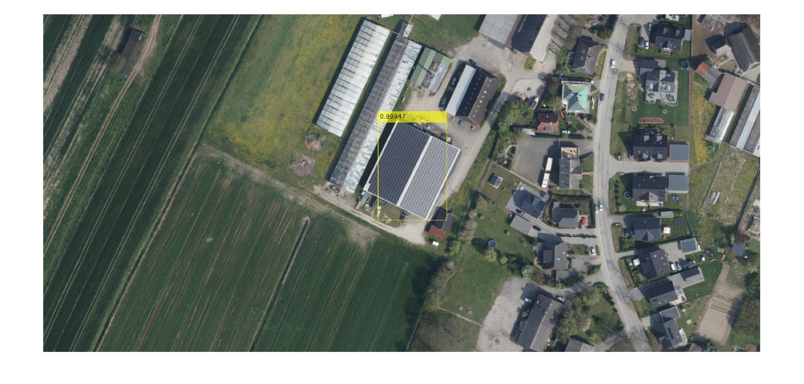
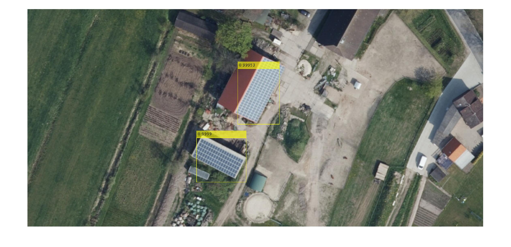
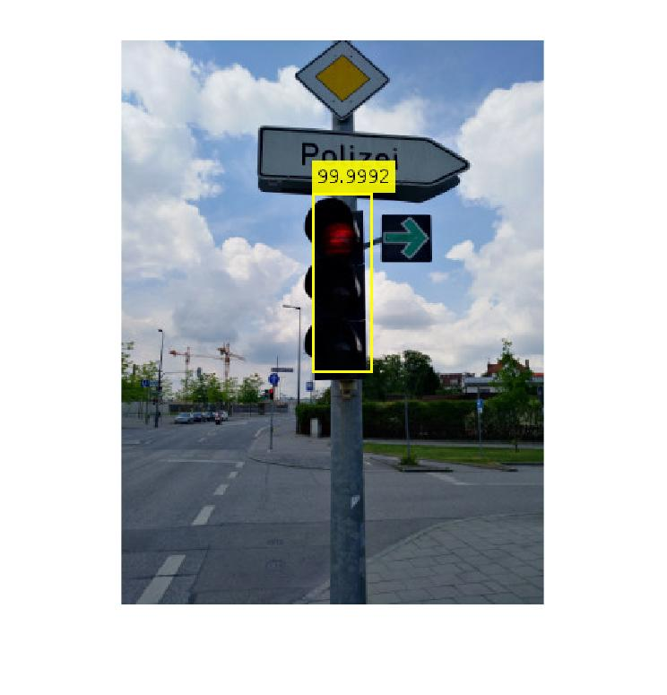
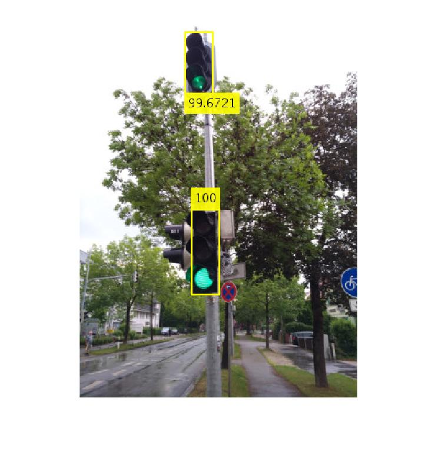
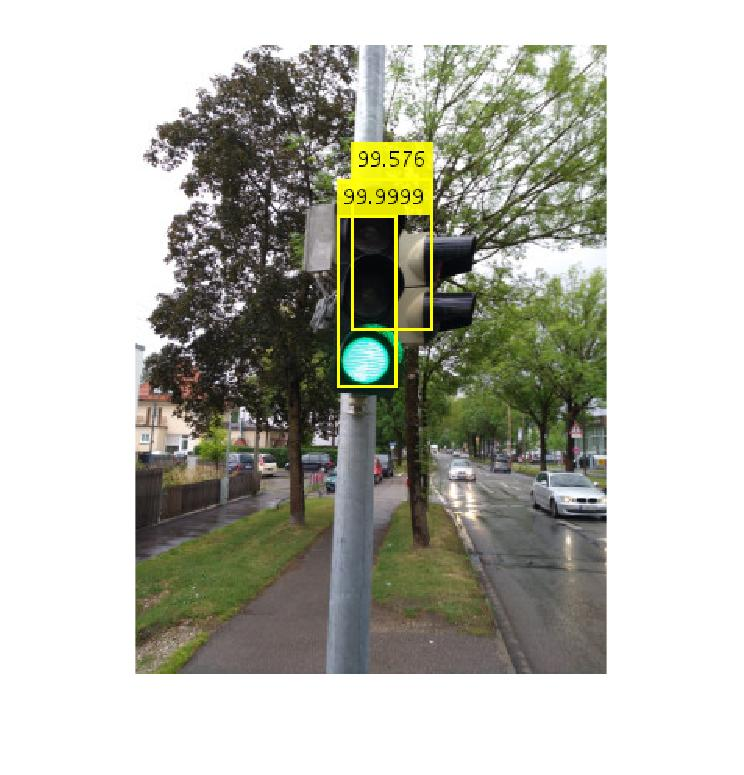
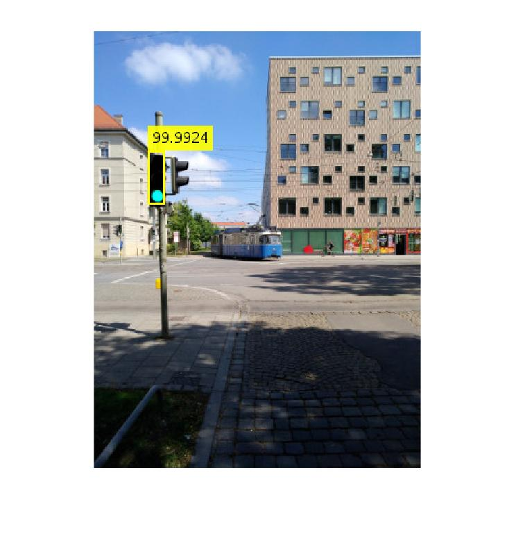

# Bildbasierte Objekterkennung mit Neuronalen Netzen

#### Beschreibung
Das Ziel dieses Projekts besteht darin, die Künstlichen Neuronalen Netze SuperVision AlexNet und VGG-16 theoretisch miteinander zu vergleichen und praktisch zu überprüfen. Dazu werden beide hinsichtlich ihrer erreichten Fehlerrate und Genauigkeit in den Aufgaben Klassifikation und Objektdetektion mit eigens gesammelten Datensätzen aus Ampeln und Solaranlagen trainiert und ausgewertet.  Die Ergebnisse bestätigen zwar, dass VGG-16 grundlegend in der erreichten Fehlerrate und Genauigkeit besser abschneidet, jedoch nur unter den Aspekten von massiv erhöhter Trainings- und Erkennungszeit.

#### Screenshots

  

#### Ergebnisse

#### Code

