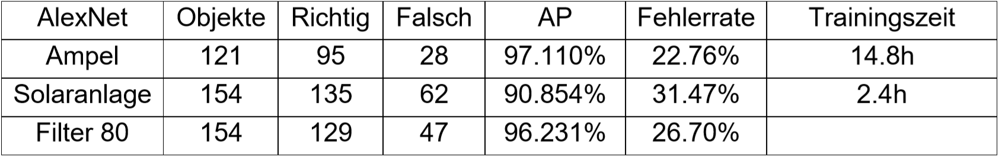

# Bildbasierte Objekterkennung mit Neuronalen Netzen

#### Beschreibung
Das Ziel dieses Projekts besteht darin, die Künstlichen Neuronalen Netze SuperVision AlexNet und VGG-16 theoretisch miteinander zu vergleichen und praktisch zu überprüfen. Dazu werden beide hinsichtlich ihrer erreichten Fehlerrate und Genauigkeit in den Aufgaben Klassifikation und Objektdetektion mit eigens gesammelten Datensätzen aus Ampeln und Solaranlagen trainiert und ausgewertet.  Die Ergebnisse bestätigen zwar, dass VGG-16 grundlegend in der erreichten Fehlerrate und Genauigkeit besser abschneidet, jedoch nur unter den Aspekten von massiv erhöhter Trainings- und Erkennungszeit.

#### Screenshots

  

#### Ergebnisse

#### trainierten Künstlichen Neuronalen Netze

#### Trainingsdaten
Für die Objektdetektion stehen unter "Trainingsdaten/Objektdetektion - Ampel" 1002 gelabelte Bilder zur Verfügung. Für die Solaranlagen sind unter "Trainingsdaten/Objektdetektion - Solaranlage" 607 Trainingsdaten verfügbar.
Die Labelling File liegen im Verzeichnis ___. Um diese zu nutzen und neue KNN mit Hilfe dieser Trainings zu trainieren müssen sie lokal in einem Verzeichnis gespeichert sowie der absolute Pfad in dem jeweiligen Labelling File angepasst werden.
Zur Anpassung des Pfades kann Code/changePath.m verwendet werden.

